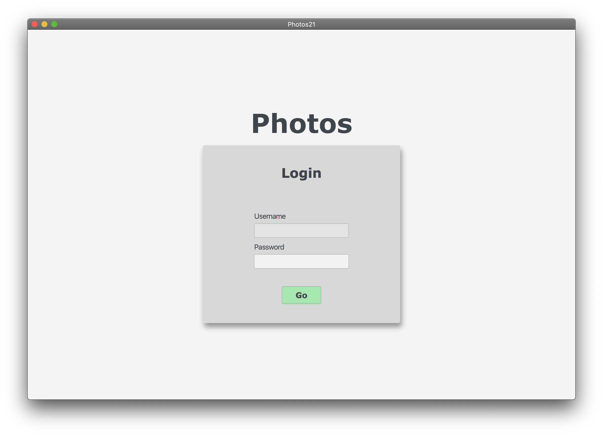
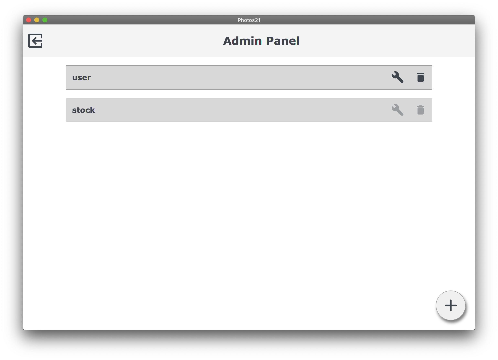
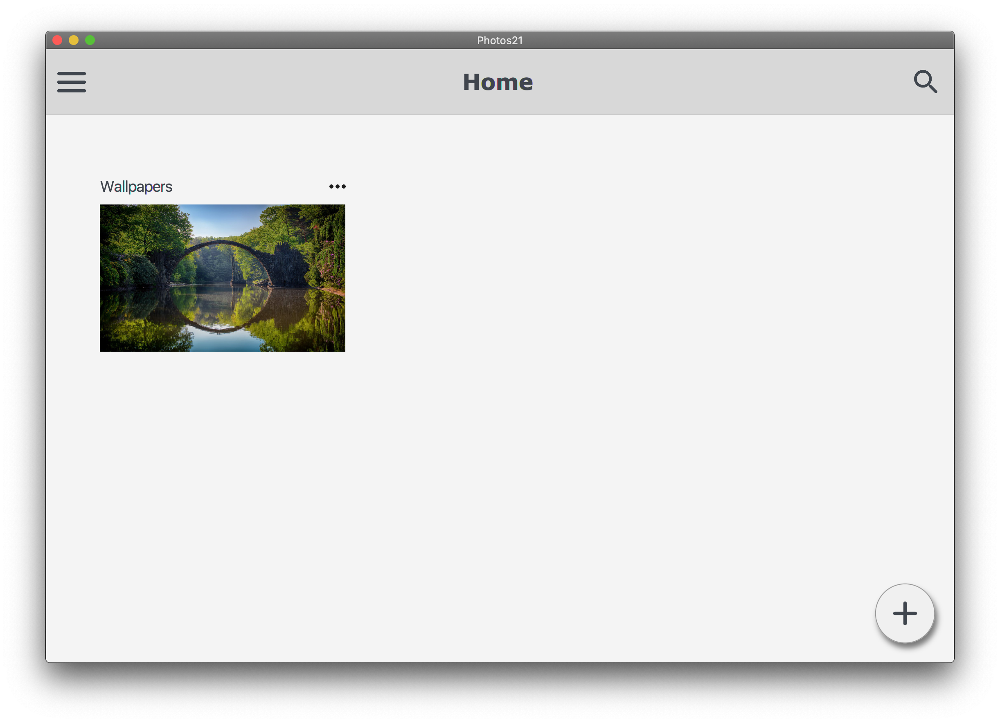
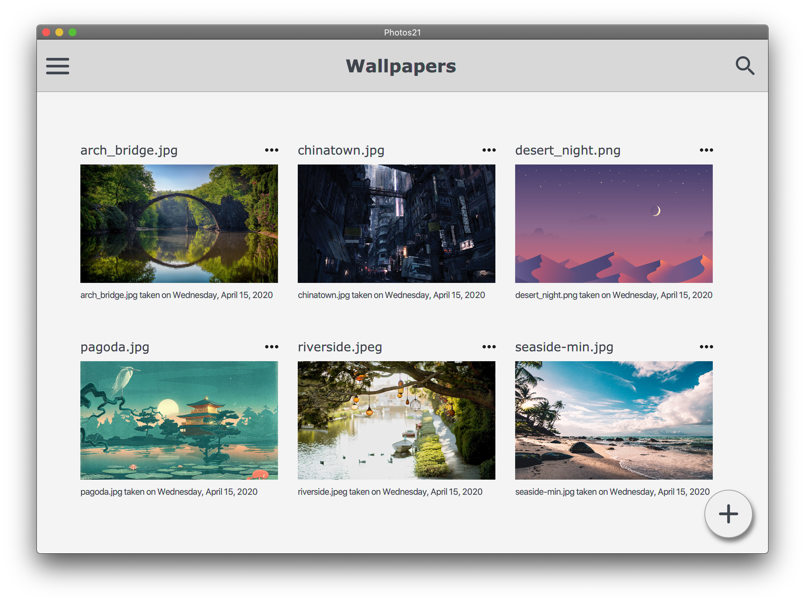
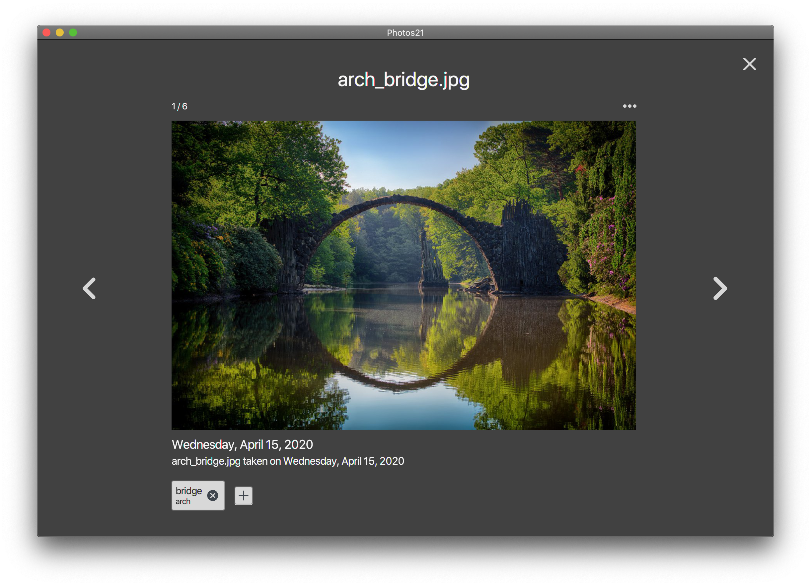
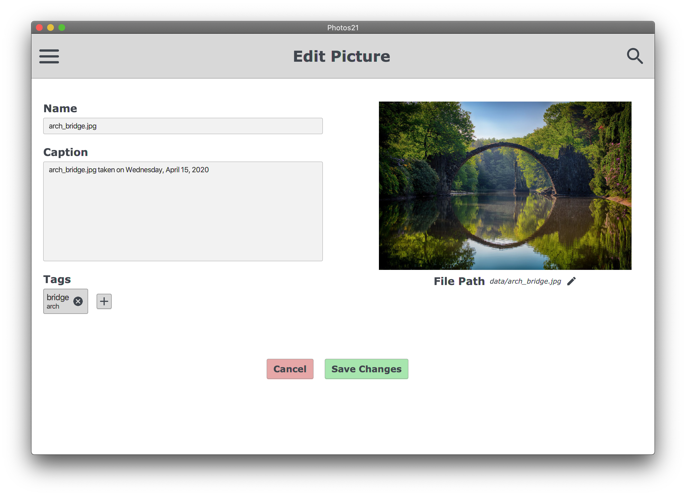
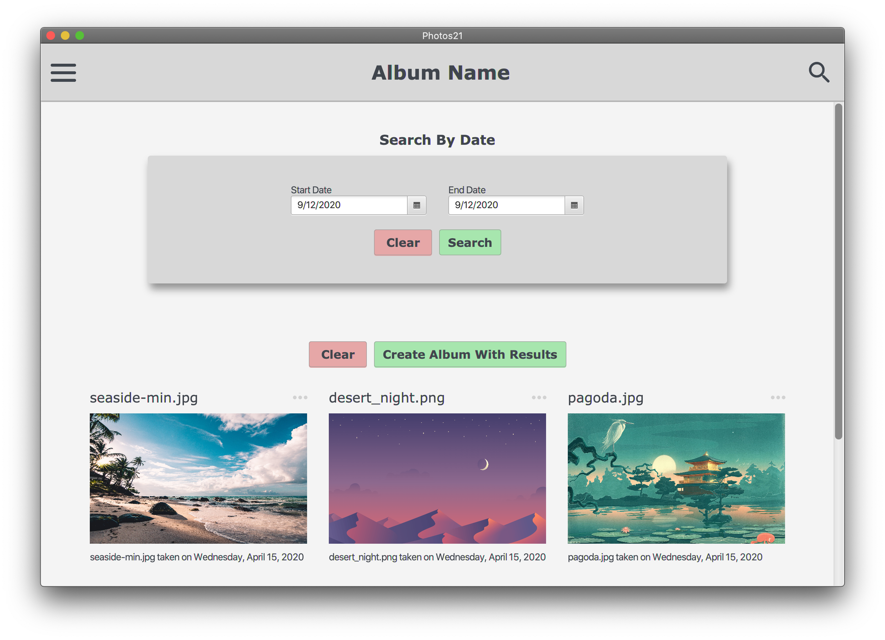

# PhotosFX
## Description
This was the third project for CS213 Software Methodology at Rutgers University. The goal was to create a photo album application using JavaFX. Created by Ray Sy and Robert Cheng.

## Features
* Clean & responsive UI
* Add/edit/delete albums
* Add/edit/delete photos
* Move/copy photos to different albums
* Search photos by date
* Create new album from search results 
* Admin panel to add/edit/delete users
* Data persistence using serialization

## Local Setup

## Gallery
Login Screen

Admin Panel

Home Screen

Album Details

Photo Gallery

Photo Editor

Search Screen
